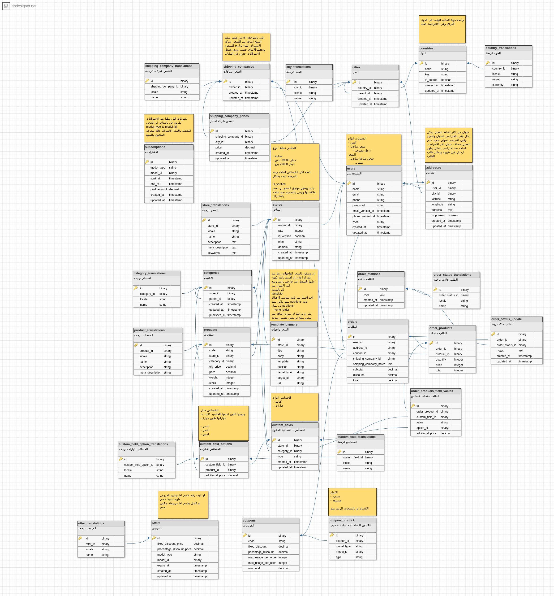

## abstract

it's a multi-vendors ecommerce website built from scratch with laravel, and it is built with:




    
 

<table>
    <thead>
        <th>home</th>
        <th>dashboard arabic</th>
    </thead>
    <tbody>
          <tr> 
              <td>
                
              </td> 
              <td> 
                
              </td> 
             </td> 
        </tr>
    </tbody>
    </table>
    <table>
    <thead>
        <th>dashboard english</th>
        <th>chat</th>
    </thead>
    <tbody>
          <tr> 
               <td>
                
             </td> 
              <td>  
                  
              </td>
        <tr>  
    </tbody>
    </table>
    <table>
    <thead>
        <th>Product Page</th>
    </thead>
    <tbody>
          <tr> 
               <td>
                
             </td> 
        <tr>  
    </tbody>
    </table>


<table>
    <thead>
        <th>packages</th>
    </thead>
    <tbody>
        <tr> <td>Laravel Modules Package</td>
            </tr>
          <tr>  <td> laravel-vue-i18n-generator (multi languages)</td> </tr>
          <tr>  <td> Laravel Spatie MediaLibrary</td> </tr>
          <tr>  <td> elnooronline package Bsforms</td> </tr>
          <tr>  <td>  davejamesmiller/laravel-breadcrumbs</td> </tr>
        <tr>  <td>  maged-karim/laravel-scaffolding</td> </tr>
    </tbody>
    </table>


<table>
    <tbody>
        <tr> <td>Laravel Passport</td>
            </tr>
          <tr>  <td> Repository Patternt</td> </tr>
          <tr>  <td> Resourses Policies</td> </tr>
          <tr>  <td> Requests</td> </tr>
          <tr>  <td>  Filters</td> </tr>
          <tr>  <td>  PHP-unit testing</td> </tr>
          <tr>  <td>  MySQL</td> </tr>
          <tr>  <td>  Vue Js</td> </tr>
          <tr>  <td>  Admin LTE3</td> </tr>
    </tbody>
    </table>


## requirements
<ul>
                <li>php >= 7.2 </li>
                <li>mysql</li>
                <li>apache</li>
                <li>laravel >= 7.0 </li>
                <li>composer</li>
      </ul>

> you must copy .env.example contents to new file .env ans setup database. 


## installation:

```
composer install

npm install

php artisan cache:clear

php artisan key:generate

php artisan serve

```

> now go to (http//:127.0.0.1:8000) 


## Roles:

<table>
    <thead>
        <th>Role</th>
        <th>Email</th>
        <th>Password</th>
        </thead>
    <tbody>
        <tr> 
            <td>Admin</td>
            <td>admin@demo.com</td>
            <td>password</td>
        </tr>
        <tr> 
            <td>Customer</td>
            <td>jeffrey@laracasts.com</td>
            <td>password</td>
        </tr>
         <tr> 
            <td>Shipping Company Owner</td>
            <td>fedex@shipping.org</td>
            <td>password</td>
        </tr>
          <tr> 
            <td>Store Owner</td>
            <td>alice@toptal.org</td>
            <td>password</td>
        </tr>
         <tr> 
            <td>Supervisor</td>
            <td>andre@madarang.org</td>
            <td>password</td>
        </tr>
    </tbody>
    </table>

